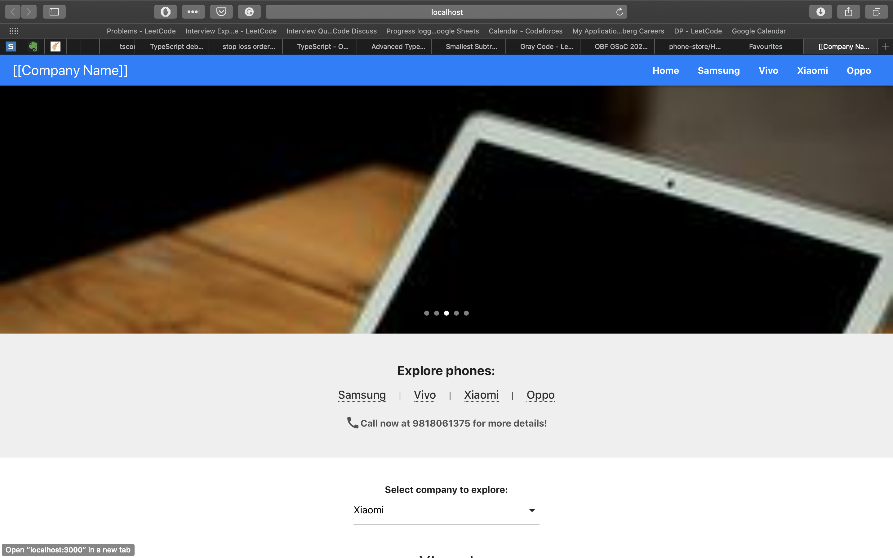
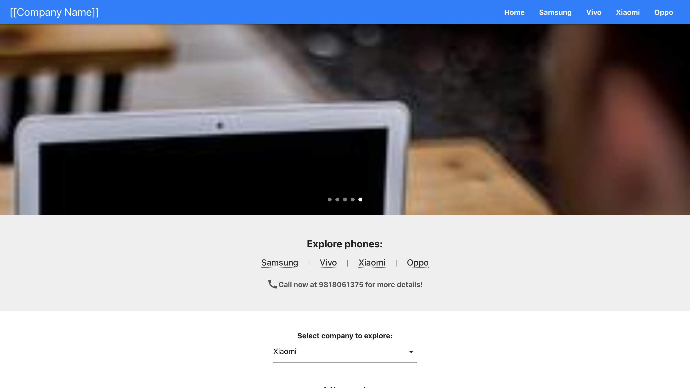
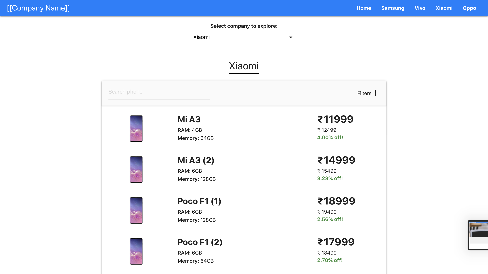
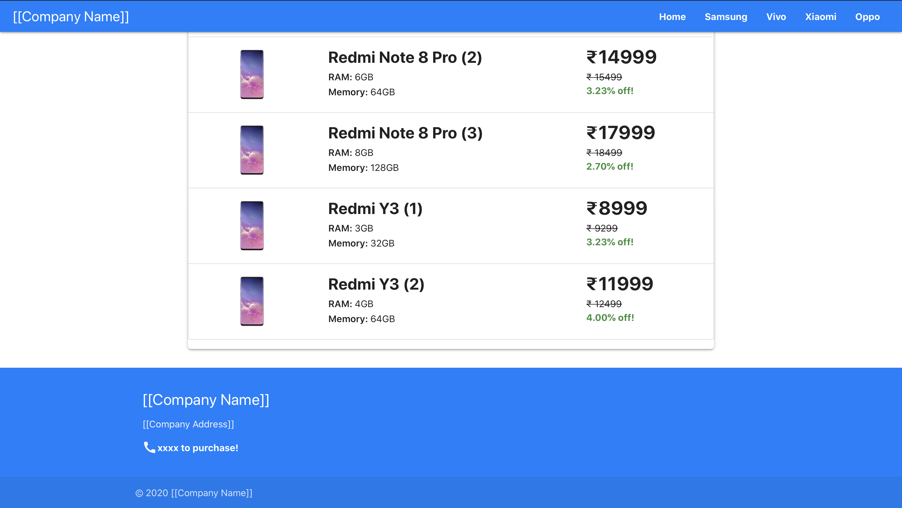
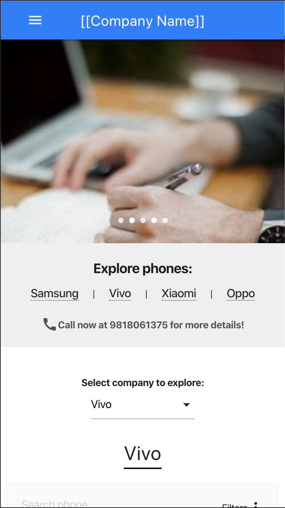
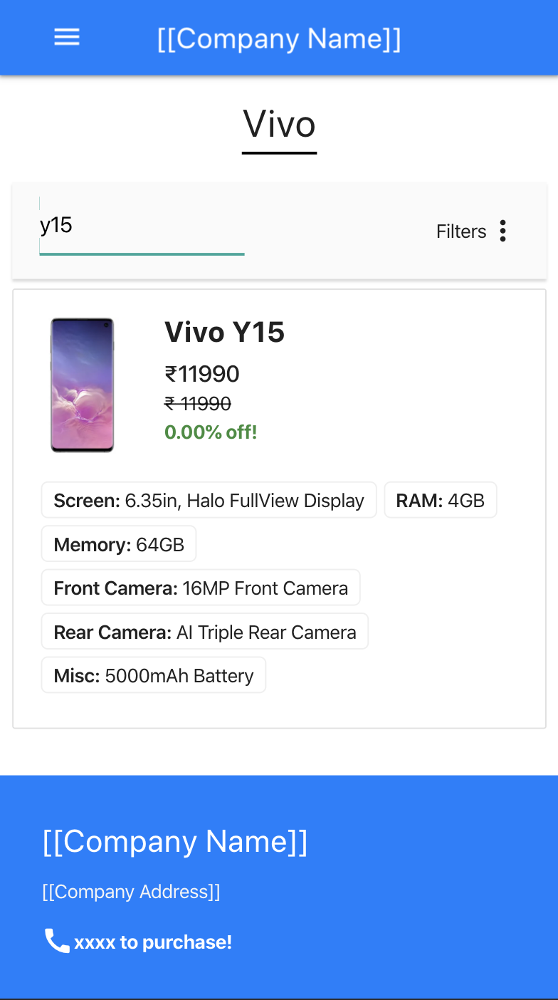

# Phone Store
A responsive React web app hosting content for a phone shop statically to help out shop owners in these times of social distancing.

# Demo
[View Demo Online](http://amarelectronics.netlify.app/)

# Run locally
- Develop
```
git clone http://github.com/sarthak-sehgal/phone-store
cd phone-store/
npm install
npm start
```

- Build
```
npm run build
```

- Deploy on Netlify
```
npm i netlify-cli -g
npm run delpoy
```

# Screenshots





